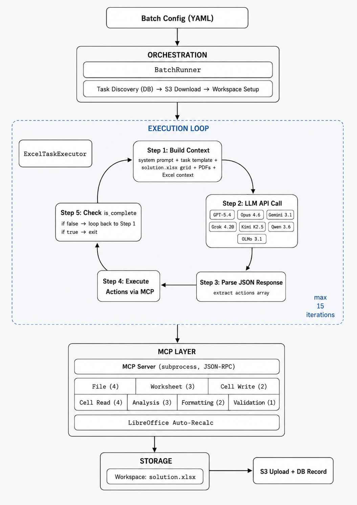

# Excel CLI Agent

AI-powered Excel automation agent that builds financial models from case materials using LLM APIs + MCP Excel tools. Supports 7 models across OpenRouter and Anthropic APIs.

## Supported Models

| Model | Slug | Provider | Reasoning |
|-------|------|----------|-----------|
| Claude Opus 4.6 | `claude-opus-4-6` | Anthropic Direct | Adaptive thinking (`effort="max"`) |
| GPT-5.4 | `openai/gpt-5.4` | OpenRouter | `reasoning_effort="xhigh"` |
| Gemini 3.1 Pro | `google/gemini-3.1-pro-preview` | OpenRouter | `reasoning_effort="high"` |
| Grok 4.20 | `x-ai/grok-4.20` | OpenRouter | `reasoning_effort="xhigh"` |
| Kimi K2.5 | `moonshotai/kimi-k2.5` | OpenRouter | Always-on |
| Qwen 3.6 Plus | `qwen/qwen3.6-plus` | OpenRouter | Always-on |
| OLMo 3.1 Instruct | `allenai/olmo-3.1-32b-instruct` | OpenRouter | None |

## Architecture

Six-layer pipeline with iterative LLM execution loop:



| Layer | Role | Key Files |
|-------|------|-----------|
| **Input** | Batch config YAML, task DB, S3 starting files | `batch_config_template_auto.yaml` |
| **Orchestration** | Task discovery, trial management, S3 download/upload | `excel_cli_agent/auto_batch_runner.py` |
| **Execution** | Iterative LLM calls (max 15 iters), JSON action parsing | `excel_cli_agent/task_executor.py` |
| **MCP** | 19 Excel tools via subprocess JSON-RPC + LibreOffice recalc | `excel_mcp_server/tools/` |
| **Validation** | System prompt rules + MCP server runtime checks | `excel_cli_agent/prompts/`, `excel_mcp_server/` |
| **Storage** | Workspace files, S3 upload, DB task_attempts record | `excel_cli_agent/auto_batch_runner.py` |

### MCP Tools (19)

| Category | Count | Tools |
|----------|-------|-------|
| File | 4 | `create_file`, `list_files`, `copy_file`, `get_file_metadata` |
| Worksheet | 3 | `list_worksheets`, `create_worksheet`, `delete_worksheet` |
| Cell Write | 2 | `edit_cells`, `set_cell_formula` |
| Cell Read | 4 | `get_cell_range`, `get_formula`, `get_used_range`, `search_worksheet` |
| Analysis | 3 | `summarize_workbook_context`, `describe_worksheet`, `scan_worksheet_structure` |
| Formatting | 2 | `format_cells`, `freeze_panes` |
| Validation | 1 | `validate_formula` |

## Quick Start

```bash
# 1. Install LibreOffice (required for formula recalculation)
apt-get update && apt-get install -y libreoffice-calc

# 2. Install the package
pip install .

# 3. Set API key in .env
cat > .env << 'EOF'
OPENROUTER_API_KEY=sk-or-...       # Required (6 of 7 models use OpenRouter)
ANTHROPIC_API_KEY=sk-ant-...       # Optional (only for Claude Opus direct API)
DATABASE_URL=postgresql://...       # Optional (only for auto mode with DB)
AWS_ACCESS_KEY_ID=...               # Optional (only for auto mode with S3)
AWS_SECRET_ACCESS_KEY=...           # Optional (only for auto mode with S3)
EOF

# 4. Run in local mode (no DB/S3 — just an API key)
excel-agent --batch-config examples/test_local.yaml

# 5. Or run auto pipeline (DB + S3)
excel-agent --batch-config my_config.yaml
```

## Running Benchmark Tasks

### Single Model

```yaml
# my_config.yaml
batch_name: "GPT 5.4 Run"
model: "openai/gpt-5.4"
auto_mode: true
reasoning_effort: "xhigh"
max_completion_tokens: 128000
workspace_base_dir: "~/workspaces/gpt54"
agent_folder: "openpyxl_openai/gpt-5.4"
max_trials: 7
trials_since: "2026-05-01"
prompt_version: "v11"
task_filter:
  missing_for_model: true
verbose: true
max_iterations: 15
fresh_context_mode: true
enhanced_excel_context: true
recent_history_count: 3
api_timeout_seconds: 600
cleanup_workspace: true
```

```bash
PYTHONUNBUFFERED=1 nohup excel-agent --batch-config my_config.yaml > ~/run.log 2>&1 &
```

### Parallel Splits

Split work across multiple processes using `task_id_min`/`task_id_max`:

```yaml
task_filter:
  task_id_min: 48
  task_id_max: 200
  missing_for_model: true
```

### Adapting for Your Research

1. **Swap models** — Change `model:` and `reasoning_effort:` in the YAML config.
2. **Edit prompts** — Modify files in `excel_cli_agent/prompts/`. Version with `_v{N}.txt` naming.
3. **Replace MCP tools** — Swap `excel_mcp_server/tools/` with your domain-specific tools. The execution loop is domain-agnostic.
4. **Change task data** — Point `task_starting_files` in the DB to your own S3 paths.
5. **Add a new model** — Add pricing to `models_config.py` and use the OpenRouter slug in config.

## Output

Each task attempt uploads to S3:

```
{timestamp}_solution.xlsx           # Agent's Excel output
{timestamp}_openai_requests.csv     # Per-iteration token/cost log
{timestamp}_task.json               # Task metadata + steps
{timestamp}_transcript.md           # Full conversation log
{timestamp}_thinking_trace.md       # Reasoning traces (if thinking enabled)
{timestamp}_batch_config.yaml       # Run config for reproducibility
```

## Troubleshooting

| Issue | Fix |
|-------|-----|
| `MCP request 'initialize' timed out` | Stagger parallel launches (3s delay). LibreOffice startup contention. |
| `'list' object has no attribute 'get'` | OLMo returns lists instead of dicts. Code has `isinstance` guards. |
| `.xlsb` files not detected | Auto-converted to `.xlsx` via pyxlsb on download. |
| `max_completion_tokens` overflow | OLMo 65K context: use 16000. Frontier models: use 128000. |
| Context window exceeded | Large starting Excel files (300K+ tokens). Reduce context or increase model context. |
